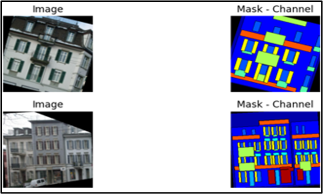
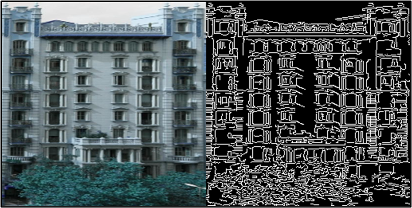
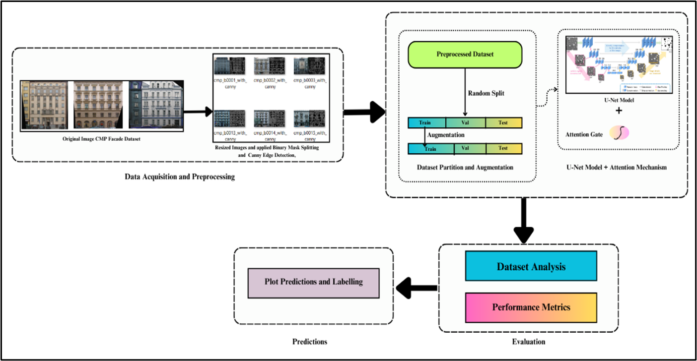
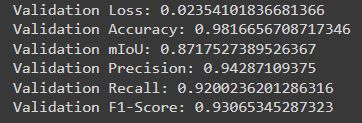
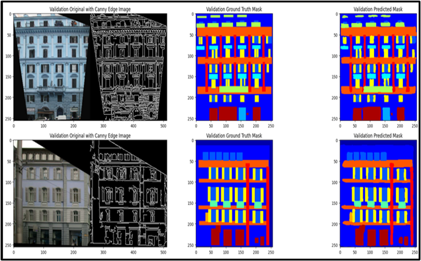
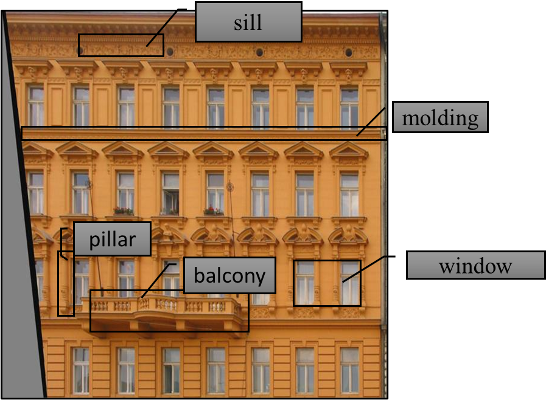
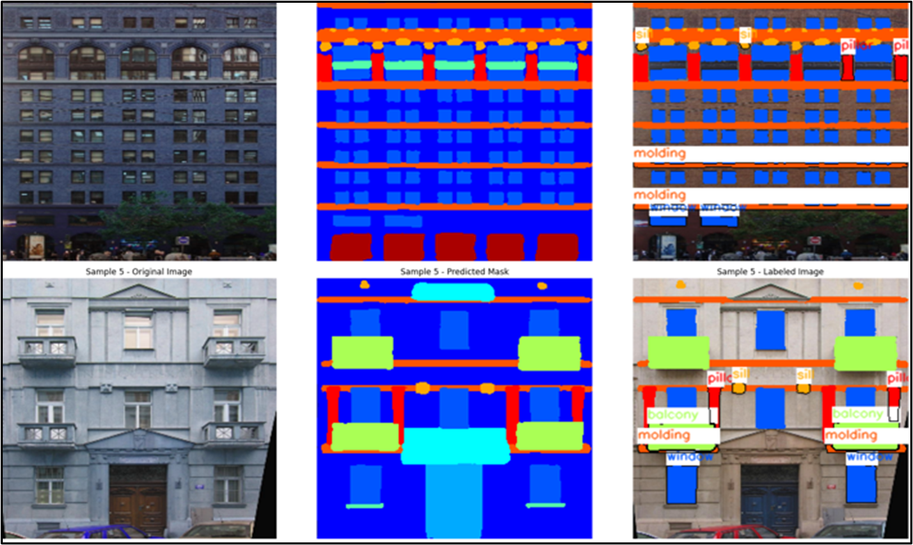

# MTech Dissertation: UNet with Spatial Attention Mechanism for Green Building Optimization

### Title: **Optimizing Green Building Implementation via Deep Learning-Powered Segmentation Techniques**

---

## 🌿 Overview

This M.Tech dissertation bridges the gap between **deep learning** and **green building** domains, contributing to the larger goal of sustainable urban development. The study focuses on using advanced semantic segmentation techniques to identify key façade components in existing buildings, enabling retrofitting with green features like vegetation, vertical gardens, or energy-efficient design.

---

## 🧩 Problem Statement

The construction sector significantly contributes to environmental degradation. Green buildings offer a sustainable solution, but traditional tools often lack the precision to retrofit existing buildings with green standards. In this work, a deep learning model has been developed to segment building façades, helping to analyze and visualize suitable zones for green implementations like planting systems, energy panels, and ventilation features.

---

## 💡 Motivation

- Modern urban areas demand transformation into eco-friendly spaces.
- Building exteriors provide untapped potential for hosting vertical greenery.
- Existing green building tools are tailored for **new constructions**, but **this research focuses on already-built structures**, providing scalable solutions to upgrade them with sustainable features.
- With accurate façade segmentation, we can target features like **balconies**, **windows**, or **pillar** that could support vegetation, improve air quality, and boost aesthetic value.

---

## 🎯 Objectives

The following objectives were formulated based on a thorough literature review and gap identification:

1. **Develop a Deep Learning-based robust U-Net Model for accurate building facade segmentation.**
2. **Enhancement of data quality by using pre-processing techniques, edge detection and creation of a new dataset.**
3. **Analyse segmented components to enhance vegetation and sustainability to choose 5 most relevant components for labelling section.**

---

## 📂 Dataset

- **Base Dataset**: [CMP Facade Dataset](https://www.researchgate.net/profile/Radim-Tylecek-2/publication/267764713_CMP_Facade_Database/links/545a2e5e0cf26d5090ad70c2/CMP-Facade-Database.pdf)
- **Enhanced Dataset**: [CED Dataset](https://github.com/ShrutiSemwal/MTech.-Dissertation-UNet-with-Attention-Mechanism/tree/main/CED%20dataset)

1. **Binary Mask Splitting** technique was applied to achieve **fine-grained separation** of labels.
2. **Canny Edge Detection** was applied to improve **edge clarity**.
3. **Custom data augmentation** was employed to address **class imbalance** and **increase the size** of the dataset.

 
<em>Data augmentation techniques applied to boost dataset variability.</em>  

  
<em>Example output from CED dataset using Canny Edge Detection for clearer feature separation.</em>

---

## 🧠 Proposed Model

A custom **UNet model** was built and enhanced with a **Spatial Multiplicative Cross-Attention Mechanism** to focus on semantically relevant regions. The network follows a typical encoder-decoder structure with:

- Convolution → DropOut → BatchNorm → Activation → Pooling  
- Attention mechanism applied in the upsampled feature maps and skip tensor values 
- Optimizer: `Adam`, Loss: `Categorical Focal Loss`  
- Metrics: `Accuracy`, `Mean IoU`, `Precision`, `Recall`, `F1-Score`

 
<em>Flow-Diagram of Model.</em>  

*UNet architecture with Spatial Attention components.*

---

## 🔍 Evaluation and Final Results

- Training was performed for **9 fits (epochs)** using the enhanced CED dataset.
- The final model demonstrated consistent improvement in segmentation accuracy and class precision: **98.1% accuracy, 87% mean Intersection over Union score and 93% f1-Score**.
- Visual comparisons of predictions indicate accurate boundary detection and effective component differentiation.
- The model successfully segments building images to highlight façade components suitable for green retrofit.

  
<em>Final model performance across multiple metrics.</em>  

  
<em>Prediction Masks generated by the model.</em>

---

## 🏷️ Labelling and Classes

The final labelled section consists of **five façade classes** most aligned with green building standards:

| Label       | BGR Color Code   | Applicability                                                               |
|-------------|------------------|-----------------------------------------------------------------------------|
| Window      | `(255, 85, 0)`   | Placement for air-purifying plants                                          |
| Balcony     | `(85, 255, 170)` | Candidate zones for vertical gardens, hanging plants and small vegetation   |
| Pillar      | `(0, 0, 255)`    | For facade-supported green walls or climbing plants                         |
| Molding     | `(0, 85, 255)`   | Vertical Planters, hanging plants or ornamental plants                      |
| Sill        | `(0, 170, 255)`  | Living Wall System where plants substrate                                   |

  
<em>Building components represented on sample image.</em>  

  
<em>Annotated façade images with 5 core components labelled.</em>

---

## ✔️ Conclusion
This research highlights how deep learning, when thoughtfully integrated with domain-specific knowledge, in this case, green building principles; can address real-world challenges such as environmental sustainability and urban infrastructure planning. By blending traditional architectural understanding with modern computer vision techniques, we not only enhance the precision of building analysis but also contribute to more informed, eco-conscious decision-making. Moving forward, such interdisciplinary approaches will be vital in designing resilient, intelligent systems that serve both technological progress and planetary well-being.
